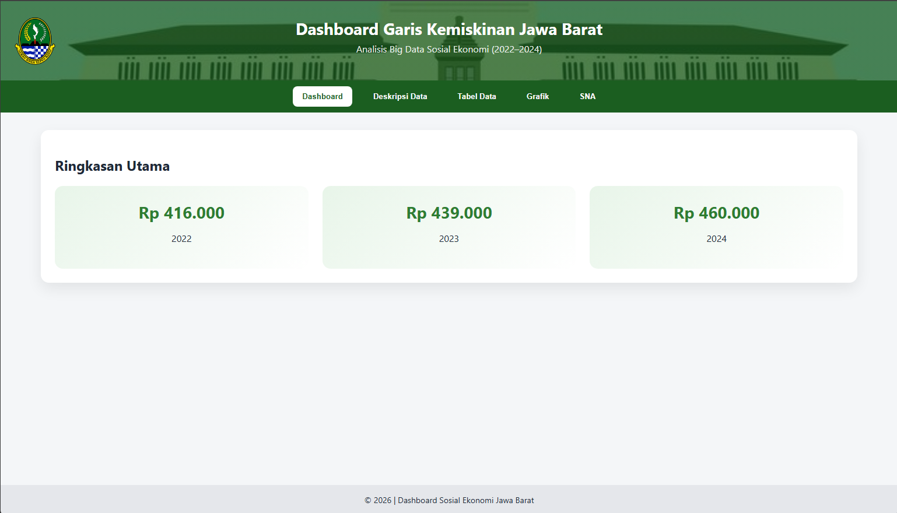
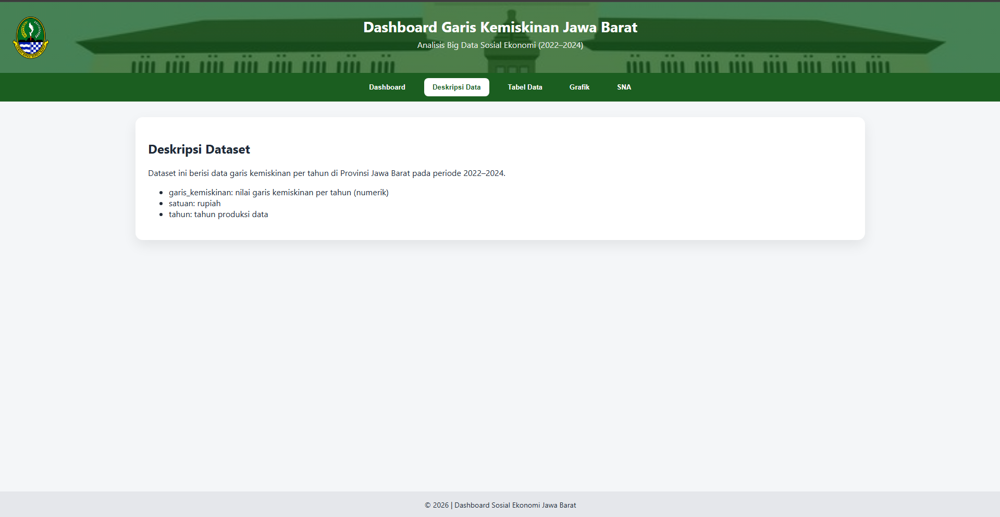
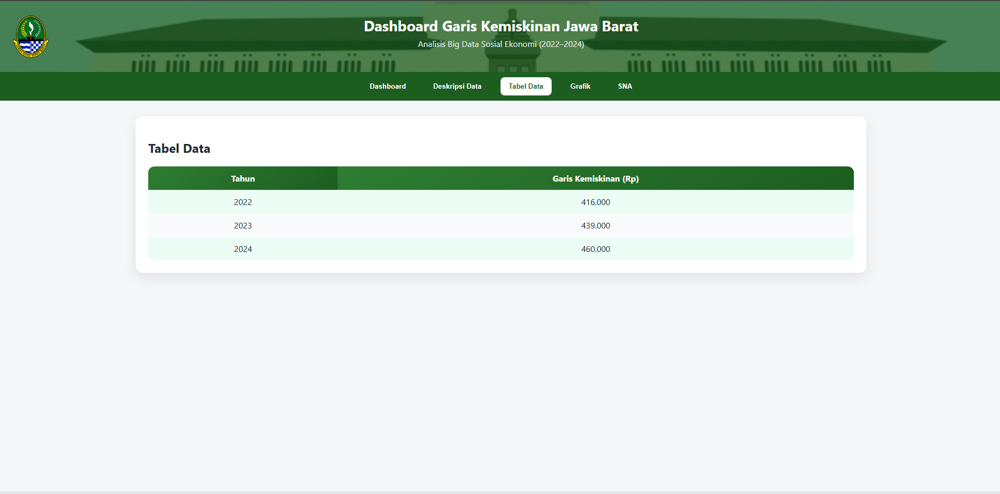
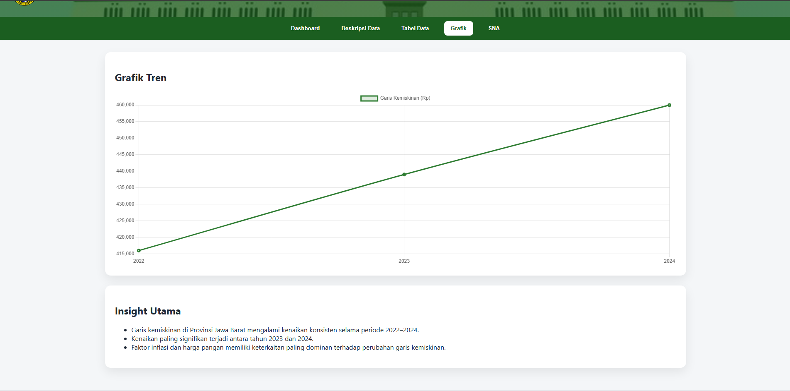
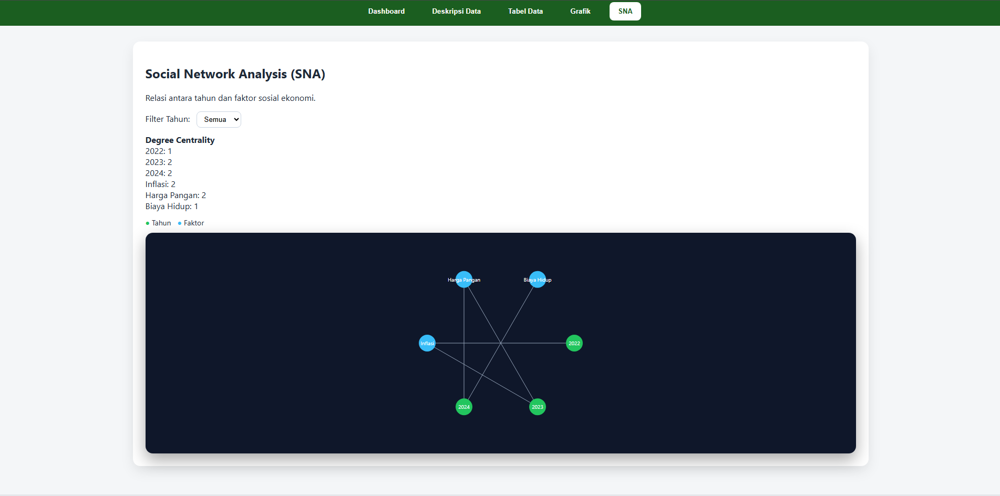

# 📊 Dashboard Analisis Garis Kemiskinan Jawa Barat

Proyek ini merupakan aplikasi dashboard berbasis web yang dikembangkan untuk menganalisis dan memvisualisasikan data garis kemiskinan di Provinsi Jawa Barat. Menggunakan pendekatan Big Data Analytics, visualisasi interaktif, dan *Social Network Analysis* (SNA), dashboard ini bertujuan membantu pengguna memahami tren kemiskinan serta faktor sosial ekonomi yang memengaruhinya secara komprehensif.

## 🌟 Sorotan Utama

* **Visualisasi Tren**: Grafik garis kemiskinan Jawa Barat periode 2022–2024.
* **Analisis Time Series**: Melihat pola kenaikan garis kemiskinan dari waktu ke waktu.
* **Social Network Analysis (SNA)**: Memetakan keterkaitan antara tahun dan faktor sosial ekonomi (seperti Inflasi dan Harga Pangan).
* **Interaktif**: Dashboard berbasis web dengan navigasi tab, grafik dinamis, dan filter data tanpa perlu reload halaman.

## 🔌 Sumber Data & Metodologi

**Sumber Data**
Data yang digunakan berasal dari data terbuka pemerintah yang memuat informasi garis kemiskinan Provinsi Jawa Barat. Data dikumpulkan dalam format terstruktur dan diproses untuk memastikan konsistensi.

**Metodologi**
Proyek ini menerapkan *Data Analytics Pipeline* sederhana:

1. **Pengumpulan & Pemrosesan**: Data dikumpulkan dan disiapkan dalam format JSON/Array di dalam kode.
2. **Visualisasi**: Menggunakan **Chart.js** untuk grafik tren dan logika JavaScript kustom untuk SNA.
3. **SNA**: Menghitung dan memvisualisasikan *degree centrality* untuk mengidentifikasi faktor dominan (Inflasi, Harga Pangan) yang mempengaruhi tahun-tahun pengamatan.

## 🚀 Cara Menjalankan Secara Lokal

Karena aplikasi ini dibangun menggunakan teknologi web standar (HTML/CSS/JS), Anda tidak perlu menginstal Python atau melakukan konfigurasi server yang rumit.

**Prasyarat:**

* Browser web modern (Chrome, Edge, Firefox, dll).
* Koneksi internet (untuk memuat library Chart.js via CDN).

**Langkah-langkah:**

1. **Clone** atau **Download** repository ini.
2. Buka folder proyek.
3. Klik dua kali file `index.html` untuk membuka langsung di browser.
4. *(Opsional/Disarankan)* Gunakan ekstensi **Live Server** di VS Code untuk pengalaman yang lebih baik.

## 🌐 Deployment (GitHub Pages)

Aplikasi ini dapat di-hosting secara gratis menggunakan GitHub Pages.

1. **Push** repository ini ke GitHub Anda.
2. Masuk ke halaman repository di GitHub.
3. Buka tab **Settings** > menu **Pages** (di sidebar kiri).
4. Pada bagian **Build and deployment**:
* **Source**: Pilih `Deploy from a branch`.
* **Branch**: Pilih `main` (atau `master`) dan folder `/ (root)`.

5. Klik **Save**.
6. Tunggu beberapa saat, dashboard Anda akan aktif di URL: `https://fajarjuli.github.io/AnalisisBigDataSosialEkonomi/`

## 📸 DOKUMENTASI

### Tampilan Utama

### Grafik Garis Kemiskinan

### Tabel Data

### Visualisasi Tambahan

   

## 📝 Kesimpulan

Dashboard ini menunjukkan bahwa garis kemiskinan di Provinsi Jawa Barat mengalami peningkatan secara konsisten dalam beberapa tahun terakhir (2022–2024). Dengan visualisasi interaktif dan pendekatan SNA, proyek ini menjadi alat bantu analisis yang efektif bagi akademisi dan masyarakat umum untuk memahami dinamika kemiskinan serta faktor-faktor dominan yang memengaruhinya.
